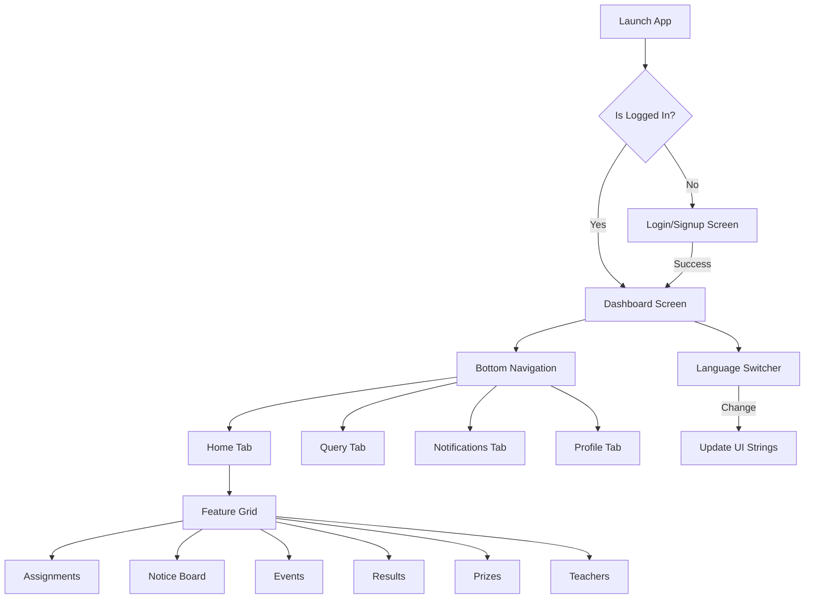

# EduBridge - Project Documentation

## 1. Project Overview
**EduBridge** is a comprehensive communication platform designed to connect parents and teachers. It aims to create a collaborative environment for student growth by providing real-time academic transparency and engagement.

- **Primary Goal**: Bridge the gap between school and home.
- **Target Users**: Parents and Teachers.
- **Platform**: Flutter (Cross-platform for Android, iOS, and Web).

---

## 2. Technical Stack
- **Frontend**: Flutter
- **State Management**: Provider
- **Backend**: Node.js + Express (under development)
- **Database**: MongoDB
- **Authentication**: JWT (JSON Web Tokens)
- **Local Storage**: Flutter Secure Storage (for auth tokens)
- **Networking**: Http & Dio

---

## 3. Project Structure (lib/)
The project follows a modular structure, though some feature screens are currently grouped under the `auth` presentation layer during initial development.

```text
lib/
├── core/
│   └── providers/          # Global state management (Auth, Theme, Language, Navigation)
├── domain/
│   └── models/             # Data models (e.g., UserModel)
├── features/
│   ├── data/               # Data layer (Repositories, Data Sources)
│   └── presentation/       # UI Layer
│       ├── auth/           # Auth screens (Login, Signup) & Core Dashboard screens
│       ├── common/          # Shared widgets
│       ├── parent/         # Parent-specific screens
│       └── teacher/        # Teacher-specific screens
├── routes/                 # App routing configuration
├── services/               # API and Backend services (AuthService, etc.)
├── theme/                  # App theme and styling (Light/Dark modes)
├── utils/                  # Constants, helpers, and utility functions
└── main.dart               # App entry point
```

---

## 4. Key Features

### 🔐 Authentication
- Dual-role support (Teacher/Parent).
- Secure login and signup with JWT integration.
- Persistent login sessions using secure local storage.

### 📊 Dashboard (Main Screen)
- **Student Profile**: Quick view of the student's name and details.
- **Attendance Viewport**: Visual tracking of student attendance.
- **Feature Grid**:
    - **Assignments**: View, search, and filter student assignments by subject and status.
    - **Notice Board**: Official school announcements and updates.
    - **Events**: Calendar of upcoming school events and parent-teacher meetings.
    - **Results**: Academic performance reports and grade tracking.
    - **Prizes**: Recognition and awards earned by students.
    - **Teachers**: Directory and profiles of school teachers.

### 💬 Communication & Queries
- **Instant Messaging**: Real-time chat between parents and teachers.
- **Query System**: Dedicated section for parents to raise queries or concerns.

### 🌐 Multilingual Support
- Built-in support for multiple languages (**English** and **Hindi**).
- Dynamic language switching via the dashboard.

### 🔔 Smart Notifications
- Real-time alerts for assignments, grades, and attendance updates.

---

## 5. Application Flow

1. **Initialization**:
   - `main.dart` initializes global providers (Navigation, Theme, Language, Auth).
   - The app starts at the `DashboardScreen` (as per current configuration) or `LoginScreen`.

2. **Authentication Flow**:
   - User signs up/logs in choosing their role (Parent/Teacher).
   - `AuthService` communicates with the backend, receives a JWT.
   - `AuthProvider` stores the token securely and updates the app state.

3. **Navigation**:
   - **Bottom Navigation Bar**:
     - `Home`: Main dashboard grid.
     - `Query`: Communication center.
     - `Notifications`: Recent updates.
     - `Profile`: User settings and account details.
   - **Internal Navigation**: Tapping items in the dashboard grid opens specialized screens (e.g., `AssignmentScreen`).

4. **Business Logic**:
   - Screens use **Providers** to listen to state changes (e.g., changing language instantly updates the entire UI).

---

## 6. Current Status & Roadmap
- ✅ Login/Signup for both Parents & Teachers.
- ✅ Core Dashboard UI and Navigation.
- ✅ Multi-language support (English/Hindi).
- ✅ Basic Assignment tracking.
- 🔜 Event scheduling and in-app notifications (In Progress).
- 🔜 Backend integration for real-time data sync.
- 🚀 Future: AI-based performance insights, Video calling for PTMs, and Admin Dashboard.

---

## 7. App Flow Diagram


---

## 8. Development Notes
- The project is currently using **dummy data** in many screens (like Assignments and Events) to demonstrate functionality while the backend is under development.
- The **Folder Structure** is evolving; currently, many feature-specific screens are located in `lib/features/presentation/auth/screens/` but will be moved to their respective feature folders as the project scales.
- **Multilingual logic** is handled by `LanguageProvider` which uses a map of keys to translate strings dynamically across the app.
